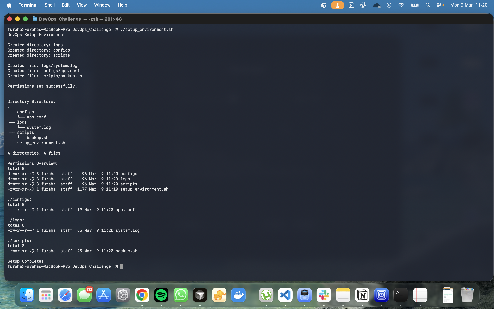
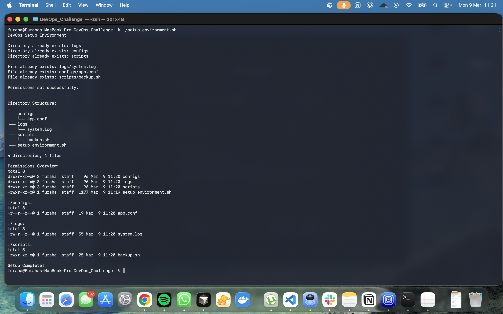

# DevOps / Sysadmin Starter Pack

## Overview

This project contains a Bash script that automatically sets up a simple system environment.  
The script creates directories, configuration files, and applies correct permissions.

---

## Project Structure

.
├── configs  
│   └── app.conf  
├── logs  
│   └── system.log  
├── scripts  
│   └── backup.sh  
├── screenshots  
│   ├── img1.png  
│   └── img2.png  
└── setup_environment.sh  

---

## How to Run the Script

Make the script executable:

chmod +x setup_environment.sh

Run the script:

./setup_environment.sh

---

## Script Execution Screenshots

### Script Execution

---

## Author

GitHub: https://github.com/Furaha-Justine